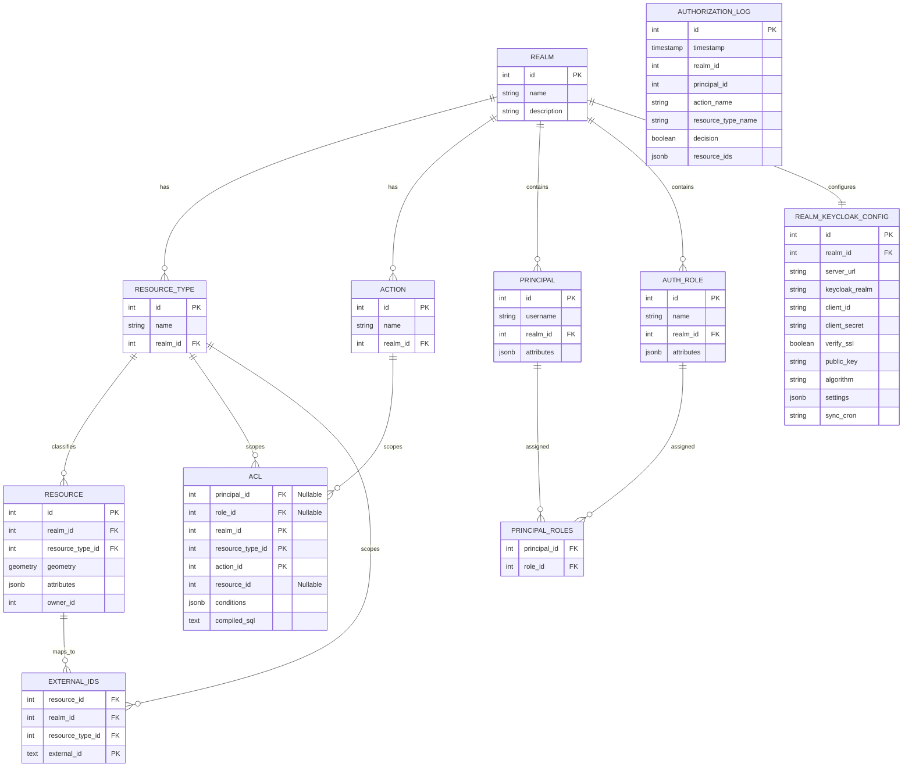

# Stateful ABAC Policy Engine - High-Performance ABAC Authorization Engine

## 1. Overview
The **Stateful ABAC Policy Engine** is a next-generation authorization service designed for high-scale, geo-spatial, and attribute-based access control (ABAC) systems. Built on **FastAPI**, **PostgreSQL 16**, and **Redis**, it leverages advanced database engineering techniques—including table partitioning, dynamic SQL compilation, and PL/pgSQL runners—to deliver sub-millisecond compiled authorization checks.

This system moves beyond traditional "Check permissions in Application Logic" by compiling complex JSON policies directly into efficient SQL `WHERE` clauses, allowing the database to filter millions of rows natively.

---

## 2. Key Advanced Features

### 2.1. Hybrid ABAC / RBAC Engine
The core differentiator is the **JIT (Just-In-Time) Policy Compiler**.
- **Dynamic Rules**: Policies are stored as JSONB in the `acl` table.
- **SQL Compilation**: A trigger (`trg_compile_acl_conditions`) automatically parses JSON rules into raw SQL logic upon insertion using a recursive PL/pgSQL compiler.
- **Supported Logic**:
  - **Logical Operators**: Nested `AND`, `OR` groups, plus `NOT` for negation.
  - **Comparators**: `=`, `!=`, `>`, `>=`, `<`, `<=`.
  - **Set Operations**: `IN`, `NOT_IN` (e.g., `status NOT IN ['deleted', 'archived']`), `ALL` (array containment).
  - **Type Safety**: Automatic type casting for `::numeric`, `::boolean`, and `::text`.

### 2.2. Context-Aware Authorization
Policies can reference dynamic runtime context, not just static attributes.
- **Context Placeholders**: Access request data dynamically.
  - `$context.ip`: The IP address of the requester.
  - `$principal.dept`: The department of the logged-in user.
- **Example Rule**:
  ```json
  {
    "op": "and",
    "conditions": [
      { "op": "=", "source": "resource", "attr": "classification", "val": "confidential" },
      { "op": "=", "source": "context", "attr": "ip", "val": "10.0.0.1" }
    ]
  }
  ```
  *Compiled SQL*: `(resource.attributes->>'classification' = 'confidential' AND p_ctx->'context'->>'ip' = '10.0.0.1')`

- **NOT Operator Example** (Negation):
  ```json
  {
    "op": "not",
    "conditions": [
      { "op": "=", "source": "resource", "attr": "deleted", "val": true }
    ]
  }
  ```
  *Compiled SQL*: `NOT (resource.attributes->>'deleted' = 'true')`

- **NOT_IN Operator Example** (Set Exclusion):
  ```json
  { "op": "not_in", "source": "resource", "attr": "status", "val": ["deleted", "archived"] }
  ```
  *Compiled SQL*: `NOT (resource.attributes->>'status' = ANY(ARRAY['deleted', 'archived']))`

### 2.3. Database Partitioning & Sharding Strategy
To handle massive scale, the system uses **Declarative Table Partitioning**.
- **Realm-Based Sharding**: Data is physically partitioned by `realm_id`.
  - `resource` -> `resource_realmname_10`, `resource_realmname_11`...
  - `acl` -> `acl_realmname_10`...

### 2.4. Authorization Runner (The "Check")
Instead of fetching all Access Control Lists (ACLs) to Python, the system pushes the check down to the database kernel.
- **Function**: `get_authorized_resources(realm_id, principal_id, ...)`
- **Mechanism**:
  1. Finds the matching compiled SQL string for the user/role.
  2. Dynamically binds context variables (`$1`, `$2`...).
  3. Executes `RETURN QUERY EXECUTE ...` to fetch only valid Resource IDs.
- **Performance**: Authorization becomes a single indexed Index Scan.

### 2.5. Audit & Compliance
- **Zero-Latency Logging**: Audit logs are dispatched via `BackgroundTasks` to avoid blocking the API response.
- **Full Traceability**: Every check logs `principal_id`, `decision`, `compiled_sql_hash`, and `execution_time`.

### 2.6. Spatial Authorization (Geo-fencing & Proximity)
Leveraging **PostGIS**, the system supports location-based rules natively.
- **Native Geometry**: Resources have a `geometry` column (Geometry, 3857).
- **Spatial Operators**:
  - `st_dwithin`: "Allow if User is within X meters of Resource".
  - `st_contains` / `st_intersects`: "Allow if Resource Polygon contains User Point".
- **Supported Formats**: The compiler auto-detects and supports:
  - **WKT** (Well-Known Text): `POINT(30 10)`
  - **GeoJSON**: `{"type":"Point","coordinates":[30,10]}`
  - **EWKT** (Extended WKT): `SRID=3857;POINT(30 10)`
- **SRID Support**: Native support for configurable input SRIDs (e.g., 4326, 3857) via API parameters. The system automatically transforms all inputs to the storage projection (3857) for consistent spatial operations.
- **Example Rule**:
  ```json
  {
    "op": "st_dwithin",
    "attr": "geometry",
    "val": "$context.location",
    "args": 5000
  }
  ```
  *Result*: Sub-millisecond spatial join verification.

### 2.7. External Identity Integration
The engine can map external system IDs (e.g., specific file IDs `IMG-001`, `DOC-999`) to internal integer IDs automatically.
- **Mapping Table**: `external_ids` table partitions map `(realm, resource_type, external_id)` -> `internal_id`.
- **Resource Type Scoping**: External IDs are scoped by resource type. The same external ID (e.g., `"EXT-001"`) can exist for multiple resource types within the same realm.
- **Multiple External IDs**: A single resource can be associated with multiple unique External IDs (aliases). The API returns all associated external IDs for a resource.
- **Disambiguation**: API endpoints for external ID operations require the resource type (ID or name) to be specified: `/resources/external/{type_id_or_name}/{external_id}`.
- **Request Flow**: Application sends `IMG-001` with type `"Image"`. Engine resolves it to internal `ID: 55`, checks permissions, and if allowed, returns `IMG-001`.
- **Reverse Mapping (Default)**: If an ID list is requested without logical filters, the system automatically looks up and returns **External IDs** instead of internal integers. Resources explicitly missing an external mapping are excluded from the response.

### 2.8. Active Roles (RBAC Override)
Supports checking permissions for a specific subset of roles, rather than all assigned roles.
- **Use Case**: "Check if the 'Manager' role has access to this document" (even if the user is also an Admin).
- **Override**: Pass `role_names=["Manager"]` in the API request. The system resolves these to Role IDs and restricts the check to the matching roles.

### 2.9. Keycloak Integration & Sync
The system includes a robust **Keycloak Adapter** and **Sync Service** to mirror Keycloak state locally for high-performance checks.
- **Realm-Specific Sync**: Each Realm can be linked to a Keycloak Realm via `realm_keycloak_config`.
- **Periodic Synchronization**: `APScheduler` runs background tasks (configurable interval) to sync:
  - **Roles**: Keycloak Realm Roles -> Apps `AuthRole`.
  - **Principals**: Keycloak Users -> App `Principal`.
  - **User-Role Mappings**: Updates local assignments.
- **API Trigger**: Sync can be triggered manually via `POST /api/v1/realms/{id}/sync`.

### 2.10. Comprehensive Entity CRUD & Batch Operations
Beyond generic policy checks, the system provides full lifecycle management for authorization entities.
- **Realm Management**: Create, Configure (Keycloak), and Manage Realms.
- **Entity CRUD**: Standard `POST`, `GET`, `PUT`, `DELETE` for Actions, ResourceTypes, Roles, Resources, and ACLs.
- **Batch Operations**: High-performance batch endpoints (e.g., `POST /realms/{id}/resources/batch`) support:
  - **Bulk Create**: Insert multiple items in one transaction.
  - **Bulk Update/Delete**: Update or Delete items using internal ID or **External ID**.
    - *Example*: Update resource geometry by providing `{"external_id": "IMG-001", "srid": 4326, "geometry": "POINT(23 38)"}`.

> **Note (Upsert Behavior)**: 
> - **Create Operations** (Single & Batch) behave as **Upserts**. If the entity exists, the system will **Update** the existing record instead of returning a duplicate error.

### 2.11. Single-Query Authorization (SearchQuery Integration)
For applications that need to combine authorization with existing database queries (e.g., search, filtering, pagination), the system provides a **Single-Query Authorization** feature that returns authorization conditions as JSON DSL.

- **Endpoint**: `POST /api/v1/get-authorization-conditions`
- **Purpose**: Get authorization conditions that can be converted to SQL WHERE clauses and merged with application queries.
- **Use Case**: "Show me all documents I can access that match my search criteria" - in a single optimized query.

#### How It Works
1. **Request**: Specify resource type, action, and optional context
2. **Processing**: 
   - PostgreSQL function aggregates all applicable ACLs (type-level + resource-level)
   - Conditions with `source='principal'` or `source='context'` are evaluated server-side
   - `$context.*` and `$principal.*` references are resolved to actual values
3. **Response**: Returns one of three filter types:
   - `granted_all`: User has unconditional access - no filtering needed
   - `denied_all`: User has no access - reject the query
   - `conditions`: JSON DSL that must be applied to the query

#### Response Schema
| Field | Type | Description |
|-------|------|-------------|
| `filter_type` | string | `'granted_all'`, `'denied_all'`, or `'conditions'` |
| `conditions_dsl` | object | JSON condition DSL (only when `filter_type='conditions'`) |
| `has_context_refs` | boolean | Whether conditions originally had `$context.*` or `$principal.*` references |

#### Condition Evaluation & Simplification
The system intelligently evaluates and simplifies conditions:
- **Principal/Context conditions**: Evaluated server-side (e.g., `$principal.department = 'Sales'`)
- **Resource conditions**: Returned in DSL for database-side evaluation
- **Short-circuit logic**: AND returns `denied_all` on first false; OR returns `granted_all` on first true
- **Simplification**: Removes evaluated `true` from AND, `false` from OR

#### Integration with SearchQuery DSL
The returned `conditions_dsl` is compatible with `search_query_dsl` library:
```python
from search_query_dsl import SearchQuery, ABACConditionConverter

# 1. Get authorization conditions
auth_result = await client.auth.get_authorization_conditions(
    resource_type_name="Document",
    action_name="read"
)

if auth_result.filter_type == "denied_all":
    return []  # No access
elif auth_result.filter_type == "granted_all":
    # Execute query without auth filter
    results = await execute_query(user_query)
else:
    # Convert and merge with user query
    auth_query = ABACConditionConverter.convert(auth_result.conditions_dsl)
    merged_query = user_query.merge(auth_query)
    results = await execute_query(merged_query)
```

### 2.12. Public Access Strategy (3-Level Authorization)
The system implements a high-performance **3-Level Waterfall** strategy to handle public vs. private resources efficiently:

1.  **Level 1: Floodgate (Public Flag)**
    -   **Mechanism**: If a *Resource Type* is marked `is_public=True`, **ALL** resources of that type are instantly accessible to **everyone** (including anonymous users).
    -   **Performance**: Zero DB lookups for ACLs. Immediate `RETURN TRUE`.

2.  **Level 2: Pattern (Type-Level ACL)**
    -   **Mechanism**: An ACL defined with `resource_id=NULL` applies to **ALL** resources of that type.
    -   **Use Case**: "All *InternalDocs* are viewable by *Employees*."
    -   **Performance**: Single ACL row evaluation.

3.  **Level 3: Exception (Resource-Level ACL)**
    -   **Mechanism**: An ACL targeting a specific `resource_id`.
    -   **Use Case**: "This specific *SecretDoc* is visible ONLY to *Alice* (even if the type is private)."
    -   **Performance**: Specific indexed lookup using the Resource ID.

---

## 3. Performance Optimizations

The `/check-access` endpoint is optimized for per-request authorization with minimal latency.

### 3.1. Multi-Layer Caching (Redis)

| Cache Layer | Data | TTL |
|-------------|------|-----|
| **Realm Map** | Action/Type/Role IDs, `is_public` flags | 1 hour |
| **Principal Cache** | User attributes + role IDs | 1 hour |
| **External ID Mapping** | `external_id → resource_id` | 1 hour |

### 3.2. Database Indexes

Optimized indexes for common query patterns:
- `idx_external_ids_lookup` - External ID resolution
- `idx_external_ids_reverse` - Reverse mapping (internal → external)
- `idx_acl_matching` - ACL query optimization
- `idx_acl_principal` / `idx_acl_role` - Partial indexes for specific ACL types

### 3.3. Batch & Parallel Processing

- **Batch External ID Resolution**: All external IDs across items resolved in a single query upfront
- **Parallel Authorization**: Multiple access items processed concurrently via `asyncio.gather()`
- **Resource ID Filter**: DB function accepts optional resource filter to avoid full table scans

### 3.4. Connection Pool Tuning

Optimized SQLAlchemy pool for high concurrency:
```python
pool_size=20, max_overflow=30, pool_pre_ping=True, pool_recycle=300
```

### 3.5. Async Audit Queue

Production audit logs are pushed to Redis queue and processed asynchronously, adding zero latency to API responses. In test mode, logs write directly to DB for immediate verification.

---

## 4. Technology Stack

| Component | Technology | Role |
|-----------|------------|------|
| **API** | FastAPI (Python 3.12) | High-performance Async REST Interface |
| **Database** | PostgreSQL 16 + PostGIS | Relational Data, JSONB, Spatial Indexing |
| **Cache** | Redis 7 | Name-to-ID Resolution (Realm/Action/Type lookups) |
| **ORM** | SQLAlchemy 2.0 (Async) | Schema definition and Migration management |
| **Identity** | Keycloak + python-keycloak | External Identity Provider & Sync |
| **Scheduler** | APScheduler | Periodic Background Synchronization |
| **Migrations** | Alembic | Version control for DB Schema & PL/pgSQL functions |
| **Testing** | Pytest + AnyIO | Async Integration Testing |

---

## 5. Installation & Setup

### Prerequisites
- Docker & Docker Compose
- Python 3.12+
- Poetry

### 5.1. Start Infrastructure
Depending on your needs, you can start the infrastructure in several ways:

**API Only (Default)**
```bash
docker compose up -d
```
Starts PostgreSQL on port `5432` and Redis on `6379`.

**Full Stack Development (with Hot-Reload UI)**
```bash
docker compose --profile ui up
```
Starts backend (8000), DB, Redis, AND the UI dev server (5173).

**Full Stack (Bundled UI)**
```bash
docker compose up app-bundled
```
Runs the backend alongside a pre-built UI served directly on port `8000`.

### 5.2. Install Dependencies
```bash
poetry install
```

### 5.3. Run Migrations
Apply the schema, triggers, and stored procedures.
```bash
poetry run alembic upgrade head
```

### 5.4. Run the API
```bash
poetry run uvicorn app.main:app --reload
```
Swagger UI available at: `http://localhost:8000/docs`

---

## 6. API Reference

Full API documentation including the **Realm Management API** is available via the interactive **Swagger UI**.
- **URL**: `http://localhost:8000/docs`
- **Key Resources**:
  - `Auth`: Token generation and access checks.
  - `Realms`: Realm CRUD, Sync Trigger, Entity Management.
  - `Manifest`: Declarative configuration import/export.

### Manifest Endpoints

#### Export Realm Configuration
**GET** `/api/v1/realms/{realm_name}/manifest`

Exports the complete realm configuration as a JSON manifest, including all entities (resource types, actions, roles, principals, resources, and ACLs).

#### Apply Manifest (Server-Side)
**POST** `/api/v1/manifest/apply?mode=update`

Upload and apply a manifest file on the server. Useful for large manifests.

**Query Parameters**:
- `mode`: Application mode (`replace`, `create`, or `update`)

**Request**: Multipart file upload with JSON manifest.

---

### Check Access Endpoint
**POST** `/api/v1/check-access`

#### Request Schema
| Field | Type | Description |
|-------|------|-------------|
| `realm_name` | string | **Required**. The Realm to check against (e.g., "DefenseRealm"). |
| `req_access` | array | **Required**. List of requested permissions. |
| `req_access[].action_name` | string | The action being performed (e.g., "view", "edit"). |
| `req_access[].resource_type_name` | string | The type of resource (e.g., "Document", "Zone"). |
| `req_access[].return_type` | string | "id_list" (default) or "decision" (boolean). |
| `req_access[].external_resource_ids` | array | **Optional**. List of external strings (e.g., `["EXT-1"]`). |
| `role_names` | array | **Optional**. Override/Switch active roles (e.g., `["Manager"]`). |
| `auth_context` | object | **Optional**. Dynamic context variables (e.g., `ip`, `location`). |

#### Curl Example
```bash
curl -X POST "http://localhost:8000/api/v1/check-access" \
  -H "Authorization: Bearer <YOUR_JWT_TOKEN>" \
  -H "Content-Type: application/json" \
  -d '{
    "realm_name": "DefenseRealm",
    "req_access": [
      { 
        "resource_type_name": "Document", 
        "action_name": "view",
        "return_type": "id_list"
      }
    ],
    "role_names": ["Manager"],
    "auth_context": {
      "ip": "192.168.1.50",
      "location": "POINT(5 5)"
    }
  }'
```

#### Response Example
```json
{
  "results": [
    {
      "action_name": "view",
      "resource_type_name": "Document",
      "answer": ["DOC-001"] 
    }
  ]
}
```

---

### Get Authorization Conditions Endpoint
**POST** `/api/v1/get-authorization-conditions`

Returns authorization conditions as JSON DSL for single-query authorization patterns.

#### Request Schema
| Field | Type | Description |
|-------|------|-------------|
| `realm_name` | string | **Required**. The Realm to check against. |
| `resource_type_name` | string | **Required**. The type of resource (e.g., "Document"). |
| `action_name` | string | **Required**. The action being performed (e.g., "read"). |
| `role_names` | array | **Optional**. Override active roles. |
| `auth_context` | object | **Optional**. Runtime context for `$context.*` resolution. |

#### Curl Example
```bash
curl -X POST "http://localhost:8000/api/v1/get-authorization-conditions" \
  -H "Authorization: Bearer <YOUR_JWT_TOKEN>" \
  -H "Content-Type: application/json" \
  -d '{
    "realm_name": "DefenseRealm",
    "resource_type_name": "Document",
    "action_name": "read",
    "auth_context": {
      "ip": "10.0.0.5",
      "department": "Engineering"
    }
  }'
```

#### Response Examples

**Granted All** (unconditional access):
```json
{
  "filter_type": "granted_all",
  "conditions_dsl": null,
  "has_context_refs": false
}
```

**Denied All** (no access):
```json
{
  "filter_type": "denied_all",
  "conditions_dsl": null,
  "has_context_refs": false
}
```

**Conditions** (apply to query):
```json
{
  "filter_type": "conditions",
  "conditions_dsl": {
    "op": "or",
    "conditions": [
      {
        "op": "and",
        "conditions": [
          { "op": "=", "source": "resource", "attr": "external_id", "val": "DOC-001" },
          { "op": "=", "source": "resource", "attr": "status", "val": "active" }
        ]
      },
      { "op": "=", "source": "resource", "attr": "classification", "val": "public" }
    ]
  },
  "has_context_refs": true
}
```

---

## Python SDK

For programmatic access, a full-featured **async Python SDK** is available with support for both HTTP and direct database modes.

### Installation
```bash
pip install stateful-abac-sdk
# or with DB mode support
pip install stateful-abac-sdk[db]
```

### Quick Example
```python
from stateful_abac_sdk import StatefulABACClient
from stateful_abac_sdk.models import CheckAccessItem

async with StatefulABACClient("http://localhost:8000/api/v1", realm="my_realm").connect(token="...") as client:
    result = await client.auth.check_access(
        resources=[
            CheckAccessItem(resource_type_name="Document", action_name="view")
        ]
    )
    print(f"Authorized IDs: {result.results[0].answer}")
```

### Key Features
- **Single Realm Scope**: Realm specified once at client creation - no `realm_id` in API calls
- **Auto-Provisioning**: Realms auto-created on connect with optional Keycloak config
- **Dual Mode**: HTTP mode (REST API) or DB mode (10-100x faster direct database access)
- **Unified Interface**: Both modes implement `IStatefulABACClient` for consistent API
- **Manifest Management**: Programmatic import/export of realm configurations

📖 **Full SDK Documentation**: [`python-sdk/README.md`](python-sdk/README.md)

---

## 7. Testing

The project includes a comprehensive test suite covering standard flows and advanced edge cases.

### Run All Tests
```bash
poetry run pytest
```

### Test Scope
- **`tests/test_abac_flow.py`**: End-to-end integration test (Setup Realm -> Create Rule -> Verify Access).
- **`tests/test_advanced_scenarios.py`**:
  - Validates `AND`/`OR` logic depth.
  - Verifies RBAC inheritance (User -> Role -> Rule).
  - Checks Context Variable substitution.
  - Verifies `IN` operator logic.
- **`tests/test_spatial_scenarios.py`**:
  - **Proximity**: Validates `st_dwithin` (e.g., finding resources within 11km).
  - **Geofencing**: Validates `st_contains` (User entering a Resource Polygon).
- **`tests/test_external_integration.py`**:
  - **External IDs**: Validates ID resolution and mapping.
  - **Active Roles**: Validates role override logic.

---

## 8. Database Schema Summary



---

## 9. ACL Examples

This section provides concrete examples of creating Access Control Lists (ACLs) and verifying them using the `/check-access` endpoint.

### 9.1. Simple Attribute Match
*Scenario*: Allow access if the resource's `status` attribute is "active".

**ACL Condition SQL** `(resource.attributes->>'status' = 'active')`:
```json
{
  "op": "=",
  "source": "resource",
  "attr": "status",
  "val": "active"
}
```

**Verification Check**:
```bash
curl -X POST "http://localhost:8000/api/v1/check-access" \
  -H "Authorization: Bearer <TOKEN>" \
  -H "Content-Type: application/json" \
  -d '{
    "realm_name": "DemoRealm",
    "req_access": [
      {
        "resource_type_name": "Document",
        "action_name": "view",
        "return_type": "id_list"
      }
    ],
    "auth_context": {}
  }'
```

### 9.2. Advanced / Nested Logic
*Scenario*: Allow access if the resource is "public" OR (the user is in the "Finance" department AND the resource is "internal").

**ACL Condition SQL**:
```json
{
  "op": "or",
  "conditions": [
    {
      "op": "=",
      "source": "resource",
      "attr": "classification",
      "val": "public"
    },
    {
      "op": "and",
      "conditions": [
        {
          "op": "=",
          "source": "principal",
          "attr": "department",
          "val": "Finance"
        },
        {
          "op": "=",
          "source": "resource",
          "attr": "classification",
          "val": "internal"
        }
      ]
    }
  ]
}
```

**Verification Check**:
```bash
curl -X POST "http://localhost:8000/api/v1/check-access" \
  -H "Authorization: Bearer <TOKEN>" \
  -H "Content-Type: application/json" \
  -d '{
    "realm_name": "DemoRealm",
    "req_access": [
      { "resource_type_name": "Document", "action_name": "view" }
    ],
    "auth_context": {}
  }'
```
*Note*: The system automatically injects principal attributes from the authenticated user's profile.

### 9.3. Geospatial Control (PostGIS)
*Scenario*: Allow access only if the user is within 5km (5000m) of the resource's location.

**ACL Condition SQL** `ST_DWithin(resource.geometry, ST_SetSRID(ST_GeomFromGeoJSON($context.location), 3857), 5000)`:
```json
{
  "op": "st_dwithin",
  "attr": "geometry",
  "val": "$context.location",
  "args": 5000
}
```

**Verification Check** (User at `[23.7, 37.9]` checking against resources near them):
```bash
curl -X POST "http://localhost:8000/api/v1/check-access" \
  -H "Authorization: Bearer <TOKEN>" \
  -H "Content-Type: application/json" \
  -d '{
    "realm_name": "DemoRealm",
    "req_access": [
      { "resource_type_name": "Zone", "action_name": "enter" }
    ],
    "auth_context": {
      "location": {
        "type": "Point",
        "coordinates": [23.7, 37.9]
      }
    }
  }'
```

### 9.4. Context, Resource, and Principal Sources
*Scenario*: Allow access if:
1. The **Context** IP is "10.0.0.5"
2. The **Resource** owner ID matches the **Principal** ID (Ownership Check).

**ACL Condition SQL**:
```json
{
  "op": "and",
  "conditions": [
    {
      "op": "=",
      "source": "context",
      "attr": "ip",
      "val": "10.0.0.5"
    },
    {
      "op": "=",
      "source": "resource",
      "attr": "owner_id",
      "val": "$principal.id"
    }
  ]
}
```

**Verification Check**:
```bash
curl -X POST "http://localhost:8000/api/v1/check-access" \
  -H "Authorization: Bearer <TOKEN>" \
  -H "Content-Type: application/json" \
  -d '{
    "realm_name": "DemoRealm",
    "req_access": [
      { "resource_type_name": "File", "action_name": "delete" }
    ],
    }
  }'
```

### 9.5. Geospatial: Geofencing (Polygon)
*Scenario*: Allow access only if the user's location is **inside** the Resource's defined polygon (e.g., a "Restricted Zone").

**ACL Condition SQL** `ST_Intersects(resource.geometry, ST_SetSRID(ST_GeomFromGeoJSON($context.user_point), 3857))`:
```json
{
  "op": "st_intersects",
  "attr": "geometry",
  "val": "$context.user_point"
}
```

**Verification Check**:
```bash
curl -X POST "http://localhost:8000/api/v1/check-access" \
  -H "Authorization: Bearer <TOKEN>" \
  -H "Content-Type: application/json" \
  -d '{
    "realm_name": "DemoRealm",
    "req_access": [
      { "resource_type_name": "Zone", "action_name": "enter" }
    ],
    "auth_context": {
      "user_point": {
        "type": "Point",
        "coordinates": [23.7, 37.9]
      }
    }
  }'
```

### 9.6. Time-Based Context
*Scenario*: Allow access only after a specific time (e.g., "Shift Start").
*Note*: This relies on ISO 8601 string comparison.

**ACL Condition SQL**:
```json
{
  "op": ">=",
  "source": "context",
  "attr": "current_time",
  "val": "2023-01-01T09:00:00Z"
}
```

**Verification Check**:
```bash
curl -X POST "http://localhost:8000/api/v1/check-access" \
  -H "Authorization: Bearer <TOKEN>" \
  -H "Content-Type: application/json" \
  -d '{
    "realm_name": "DemoRealm",
    "req_access": [ { "resource_type_name": "ShiftReport", "action_name": "read" } ],
    "auth_context": {
      "current_time": "2023-01-01T09:30:00Z"
    }
  }'
```

### 9.7. Nested Principal Attributes (Hierarchical ABAC)
*Scenario*: Allow access if the user's `security_profile.clearance.level` is greater than or equal to 5.

**ACL Condition SQL** `(p_ctx->'principal'->'security_profile'->'clearance'->>'level')::numeric >= 5`:
```json
{
  "op": ">=",
  "source": "principal",
  "attr": "security_profile.clearance.level",
  "val": 5
}
```

*Note*: The compiler automatically handles the nested JSON pathing (`->` vs `->>`) based on the dot notation.

**Verification Check**:
```bash
# Assuming the Principal has attributes:
# { "security_profile": { "clearance": { "level": 7 } } }

curl -X POST "http://localhost:8000/api/v1/check-access" \
  -H "Authorization: Bearer <TOKEN>" \
  -H "Content-Type: application/json" \
  -d '{
    "realm_name": "DemoRealm",
    "req_access": [ { "resource_type_name": "ClassifiedDoc", "action_name": "read" } ],
    "auth_context": {}
  }'
```

---

## 📄 License

This project is licensed under the [MIT License](LICENSE).

